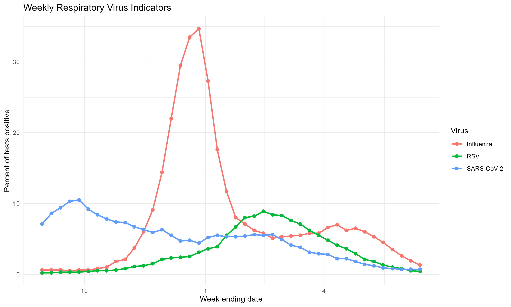
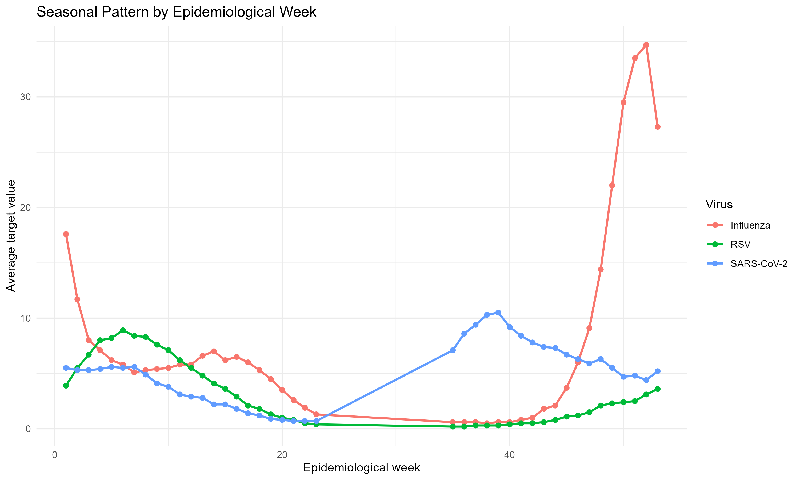
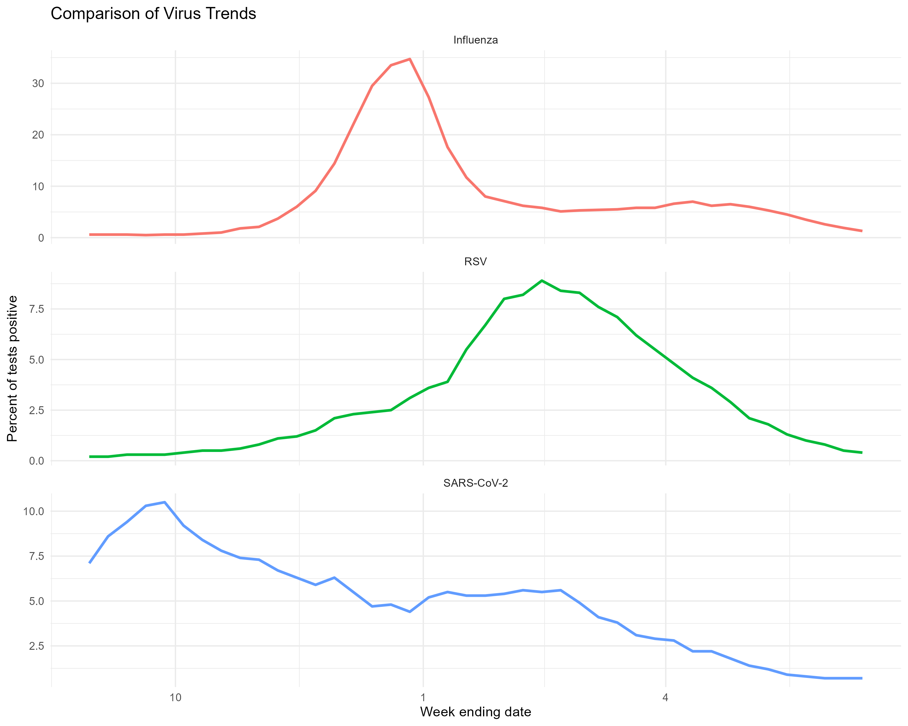
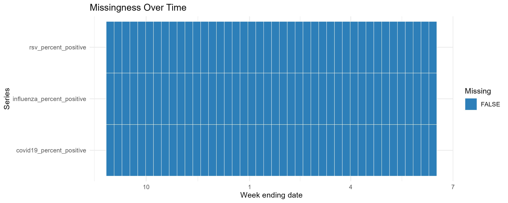

# Statistical Time Series Modeling of Canadian Respiratory Virus Surveillance Data

## 1. Introduction

This project analyzes weekly Canadian respiratory virus laboratory surveillance data using statistical time-series methods in R. The main objective is to examine temporal patterns in respiratory virus percent positivity and to compare short-term forecasting models for selected virus indicators.

The analysis focuses on three respiratory virus indicators:

- Influenza
- RSV
- COVID-19, represented in the dataset as SARS-CoV-2

The main outcome variable is **percent of tests positive**, because it adjusts positive detections by the number of tests performed and is therefore more comparable over time than raw detection counts alone.

## 2. Data

The data were obtained from the Government of Canada Health Infobase respiratory virus surveillance data portal:

[Canadian respiratory virus surveillance report: Explore the data](https://health-infobase.canada.ca/respiratory-virus-surveillance/explore.html)

The downloaded files used or stored in this project are:

- `Laboratory data - 2026-05-29.csv`
- `Clinical data - 2026-05-29.csv`
- `Data_Dictionary.xlsx`

The main analysis uses the laboratory data file. The clinical data file was not used in this version of the analysis because the project first focuses on laboratory indicators.

The laboratory dataset contains 420 rows and 9 columns. The important variables are:

| Variable | Description |
|---|---|
| `Jurisdiction` | Reporting geography. In this file, the jurisdiction is Canada. |
| `Surveillance year` | Surveillance reporting year. |
| `Surveillance week` | Epidemiological surveillance week. |
| `Week ending date` | Last day of the surveillance week. |
| `Year_Week` | Combined year-week code. |
| `Virus` | Respiratory virus under surveillance. |
| `Tests` | Number of specimens tested. |
| `Detections` | Number of positive specimens. |
| `Percent of tests positive` | Positive specimens divided by tested specimens, multiplied by 100. |

The cleaned modeling dataset contains 42 weekly observations from 2025-08-30 to 2026-06-13. Since this is less than one full annual cycle, seasonal findings should be interpreted cautiously.

## 3. Software and R Packages Used

The analysis was conducted in R. The main script is:

```r
scripts/run_analysis.R
```

The project uses the following R packages:

| Package | Purpose |
|---|---|
| `tidyverse` | Data manipulation and workflow utilities. |
| `lubridate` | Date parsing and date handling. |
| `readxl` | Reading the Excel data dictionary. |
| `forecast` | ARIMA and SARIMA model fitting using `auto.arima()`. |
| `tseries` | Augmented Dickey-Fuller stationarity tests. |
| `vars` | Vector autoregression modeling. |
| `lmtest` | Granger causality tests. |
| `ggplot2` | Exploratory data visualization. |
| `zoo` | Time-series support functions. |
| `here` | Project-root relative file paths. |

The code is organized as follows:

- `R/preprocessing.R`: data loading, inspection, target selection, and cleaned dataset creation
- `R/visualization.R`: exploratory plots
- `R/evaluation.R`: train/test split and forecast accuracy metrics
- `R/modeling.R`: ADF tests, ARIMA/SARIMA models, Ljung-Box residual tests, VAR, and Granger tests
- `scripts/run_analysis.R`: main script that runs the full workflow

## 4. Methods

### 4.1 Preprocessing

The laboratory data were loaded from `data/raw/`. The analysis inspected column names, missing values, virus categories, date/week variables, and geography variables. The data dictionary was also loaded from `Data_Dictionary.xlsx` to verify variable meanings.

The selected viruses were:

- `Influenza`
- `RSV`
- `SARS-CoV-2`

The selected target variable was:

```text
Percent of tests positive
```

The cleaned data were saved in two forms:

- `data/processed/cleaned_weekly_lab_long.csv`
- `data/processed/cleaned_weekly_lab_wide.csv`

### 4.2 Exploratory Data Analysis

Four exploratory plots were created:

- Weekly time series by virus
- Seasonal pattern by epidemiological week
- Comparison of virus trends
- Missingness over time

These figures were saved in the `figures/` folder.

### 4.3 Stationarity Testing

The Augmented Dickey-Fuller (ADF) test was used to check whether each virus time series appeared stationary.

The null hypothesis of the ADF test is:

```text
H0: The series has a unit root and is non-stationary.
```

A small p-value provides evidence against the null hypothesis.

### 4.4 Forecasting Models

Two types of univariate forecasting models were compared:

1. ARIMA models
2. SARIMA models

Both were fitted using `forecast::auto.arima()`. ARIMA models were fitted with `seasonal = FALSE`, while SARIMA models were fitted with `seasonal = TRUE`.

Forecast accuracy was evaluated using a chronological train/test split:

- Training set: first 34 weekly observations
- Test set: final 8 weekly observations

The accuracy metrics were:

- Mean Absolute Error (MAE)
- Root Mean Squared Error (RMSE)

### 4.5 Residual Diagnostics

The Ljung-Box test was used to check whether model residuals still contained autocorrelation.

The null hypothesis of the Ljung-Box test is:

```text
H0: The residuals are independently distributed with no remaining autocorrelation.
```

If the p-value is less than 0.05, this suggests that residual autocorrelation may remain and the model may not fully capture the time-series structure.

### 4.6 VAR and Granger Predictive Lead-Lag Tests

A vector autoregression (VAR) model was fitted using the three virus percent positivity series. Pairwise Granger causality tests were then used to examine whether past values of one virus indicator improved prediction of another virus indicator.

In this report, Granger causality is interpreted only as a **predictive lead-lag association**. It is not interpreted as biological or epidemiological causation.

## 5. Results

### 5.1 Exploratory Patterns

The weekly time-series plot shows different temporal patterns across the three virus indicators.



Influenza percent positivity increased sharply in late 2025, peaking around late December 2025, and then declined through early 2026. RSV percent positivity increased more gradually and peaked later, around February 2026. COVID-19/SARS-CoV-2 percent positivity was highest near the beginning of the study period and generally declined over time.



Because the dataset contains only 42 weekly observations, the seasonal plot should be treated as descriptive rather than as strong evidence of a stable annual seasonal cycle.



The missingness plot showed no missing values for the selected modeling series.



### 5.2 ADF Stationarity Tests

| Series | ADF statistic | p-value | Interpretation |
|---|---:|---:|---|
| Influenza percent positive | -1.932 | 0.600 | Fail to reject non-stationarity. |
| RSV percent positive | -1.796 | 0.654 | Fail to reject non-stationarity. |
| COVID-19 percent positive | -2.936 | 0.205 | Fail to reject non-stationarity. |

All three p-values were greater than 0.05. Therefore, the ADF tests did not provide strong evidence that the original percent positivity series were stationary.

### 5.3 ARIMA and SARIMA Forecast Comparison

| Series | Model | Selected order | MAE | RMSE |
|---|---|---|---:|---:|
| COVID-19 percent positive | ARIMA | (1, 1, 0) | 1.175 | 1.235 |
| COVID-19 percent positive | SARIMA | (1, 1, 0) | 1.175 | 1.235 |
| RSV percent positive | ARIMA | (0, 1, 4) | 1.667 | 1.804 |
| RSV percent positive | SARIMA | (0, 1, 4) | 1.667 | 1.804 |
| Influenza percent positive | ARIMA | (3, 0, 0) | 2.013 | 2.214 |
| Influenza percent positive | SARIMA | (3, 0, 0) | 2.013 | 2.214 |

In this dataset, ARIMA and SARIMA produced the same selected orders and the same forecast accuracy values for each virus series. This is likely related to the short time span of the dataset. With only 42 weekly observations, there is limited information for estimating a stable seasonal component.

Among the three indicators, COVID-19/SARS-CoV-2 had the lowest RMSE, followed by RSV and influenza.

### 5.4 Ljung-Box Residual Diagnostics

| Series | Model | Order | Ljung-Box p-value | Interpretation |
|---|---|---|---:|---|
| Influenza percent positive | ARIMA/SARIMA | (3, 0, 0) | 0.445 | No strong evidence of residual autocorrelation. |
| RSV percent positive | ARIMA/SARIMA | (1, 2, 1) | 0.357 | No strong evidence of residual autocorrelation. |
| COVID-19 percent positive | ARIMA/SARIMA | (4, 1, 1) | 0.028 | Residual autocorrelation may remain. |

The Ljung-Box test results suggest that the influenza and RSV fitted models did not show strong evidence of remaining residual autocorrelation at lag 10. However, the COVID-19/SARS-CoV-2 model had a p-value below 0.05, suggesting that the residuals may still contain autocorrelation. This indicates that the COVID-19 model may need further refinement if the goal is accurate forecasting.

### 5.5 VAR Model

A VAR model was fitted using the three percent positivity series:

- Influenza percent positive
- RSV percent positive
- COVID-19/SARS-CoV-2 percent positive

The selected VAR lag order was 3 using the AIC-based lag selection in the R workflow. The model AIC was 194.025.

Because the dataset is short, this VAR result should be interpreted as exploratory.

### 5.6 Granger Predictive Lead-Lag Tests

The Granger tests were run pairwise with lags 1 through 4. These tests evaluate predictive lead-lag association only.

Notable p-values below 0.05 included:

| Caused series | Causing series | Lag | p-value |
|---|---|---:|---:|
| RSV percent positive | Influenza percent positive | 1 | 0.0188 |
| RSV percent positive | Influenza percent positive | 2 | 0.0106 |
| RSV percent positive | Influenza percent positive | 3 | 0.0001 |
| RSV percent positive | Influenza percent positive | 4 | 0.0003 |
| RSV percent positive | COVID-19 percent positive | 1 | 0.0151 |

These results suggest that past influenza percent positivity contains predictive information for RSV percent positivity in this dataset. Past COVID-19/SARS-CoV-2 percent positivity also showed predictive information for RSV at lag 1.

However, these are predictive statistical associations only. They should not be interpreted as evidence that one virus biologically causes another virus.

## 6. Limitations

This analysis has several limitations:

1. The dataset contains only 42 weekly observations, which is less than one full annual cycle.
2. Seasonal patterns are therefore descriptive and should not be treated as definitive annual seasonality.
3. ARIMA and SARIMA models selected the same model orders in this version, so SARIMA did not show a clear advantage.
4. VAR and Granger results are exploratory because multivariate time-series models usually benefit from longer time series.
5. The analysis uses national-level data only and does not examine provincial or age-specific patterns.

## 7. Conclusion

This project used R-based statistical time-series methods to analyze Canadian respiratory virus laboratory surveillance data. Percent positivity was modeled for influenza, RSV, and COVID-19/SARS-CoV-2.

The exploratory plots showed distinct temporal patterns across viruses. The ADF tests did not provide strong evidence that the original series were stationary. ARIMA and SARIMA forecasting models were compared using an 8-week chronological test set, and COVID-19/SARS-CoV-2 had the lowest forecast error among the three indicators. Ljung-Box residual diagnostics suggested that the influenza and RSV models had no strong evidence of remaining residual autocorrelation, while the COVID-19/SARS-CoV-2 model may require further refinement.

The VAR and Granger analyses suggested possible predictive lead-lag relationships, especially from influenza percent positivity to RSV percent positivity. These findings should be interpreted as predictive associations only, not as biological causation.

Overall, the project demonstrates a clean statistical time-series workflow for public respiratory virus surveillance data, while also showing that stronger seasonal and multivariate conclusions would require a longer surveillance period.
